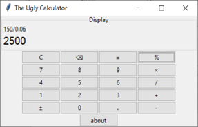

Содержит:

* дисплей – большими жирными символами снизу пишется текущее число или результат, обычными символами сверху пишется история;
* цифровую клавиатуру (кнопки `0` - `9`);
* кнопки арифметических операций (- / + ×);
* кнопка `±` позволяет сменить знак;
* кнопка `.` позволяет вводить дробные числа;
* кнопка `С` стирает и текущее число, и историю, кнопка `⌫` стирает только последний символ в текущем числе;
* кнопка `%` позволяет выполнять операции с процентами;
* кнопка `=` позволяет получить результат;
* кнопка `about` позволяет получить информацию об авторе.

